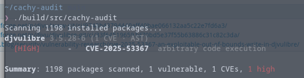
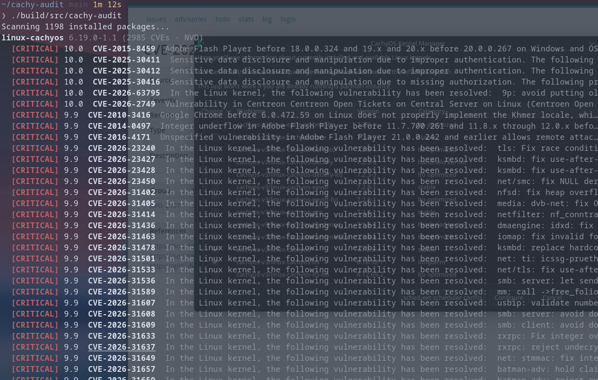

# cachy-audit

A fast, CachyOS-specific vulnerability auditor. `cachy-audit` scans
every package installed on your system, queries public CVE databases, you get a
severity-ranked report with CVSS scores and CVE links to the entries.

## Features

- **Full system scan** — audits every package reported by `pacman -Q`
- **Two data sources, picked automatically**
  - Kernel packages (`linux-cachyos`, `linux-zen`, …) → the
    [NVD](https://nvd.nist.gov) (CVE API, matched by kernel CPE)
  - Everything else → the
    [Arch Security Tracker](https://security.archlinux.org)
- **CachyOS-aware filtering** — the Arch Security Tracker records the version
  that was current when an issue was filed and rarely updates it, while
  CachyOS packages routinely run ahead of Arch's. Findings whose recorded
  `affected` version is older than your installed version (or whose `fixed`
  version you already have) are treated as stale and hidden, using a
  libalpm-compatible version comparison — the same logic pacman uses
- **Real CVSS scores** — parses CVSS v3.x vector strings
  (`CVSS:3.1/AV:N/AC:L/...`) and computes the official base score
- **Pretty terminal output** — severity-colored badges, packages sorted
  worst-first, OSC 8 clickable hyperlinks to the CVE database entries

## Example

```console
$ cachy-audit
Scanning 1533 installed packages...
linux-cachyos-lts 6.18.52-1 (110 CVEs · NVD)
  [CRITICAL] 9.9  CVE-2026-31501  In the Linux kernel, the following vulnerability has been resolved:  net: ti: icssg-prueth…
  [CRITICAL] 9.9  CVE-2026-31589  In the Linux kernel, the following vulnerability has been resolved:  mm: call ->free_folio…
  [CRITICAL] 9.9  CVE-2026-43414  In the Linux kernel, the following vulnerability has been resolved:  scsi: qla2xxx: Comple…
  [CRITICAL] 9.9  CVE-2026-53260  In the Linux kernel, the following vulnerability has been resolved:  tcp: Add preempt_{dis…
...
```

A clean system reports:

```console
No known vulnerabilities found (1245 packages scanned)
```

### vs. `arch-audit`

- While `arch-audit` shows many vulnerabilities, although all are up-to-date

```txt
> sudo arch-audit
djvulibre is affected by arbitrary code execution. High risk!
grub is affected by multiple issues. High risk!
libxml2 is affected by denial of service. High risk!
pam is affected by arbitrary filesystem access. High risk!
coreutils is affected by information disclosure. Medium risk!
cpio is affected by arbitrary command execution. Medium risk!
giflib is affected by information disclosure. Medium risk!
libheif is affected by information disclosure. Medium risk!
libtiff is affected by unknown, denial of service. Medium risk!
openjpeg2 is affected by arbitrary code execution. Medium risk!
openssl is affected by arbitrary command execution, certificate verification bypass. Medium risk!
openvpn is affected by information disclosure. Medium risk!
perl is affected by signature forgery, directory traversal, unknown. Medium risk!
systemd is affected by information disclosure. Medium risk!
wget is affected by information disclosure. Medium risk!
xdg-utils is affected by information disclosure. Medium risk!
lua51 is affected by denial of service. Low risk!
```

- `cachy-audit` does not display any

```txt
Scanning 1512 installed packages...
Retrieved 0 instances of vulnerabilities...
No known vulnerabilities found (1512 packages scanned)
```

## Requirements

- A pacman-based distro (built for CachyOS, works on Arch)
- CMake ≥ 3.21
- A C++20 compiler (GCC 13+ / Clang 17+)
- `libcurl`

## How to Build

- Build:

```console
cmake -B build -DCMAKE_BUILD_TYPE=Release
cmake --build build
```

- There are no flags — you just run it:

```console
./build/src/cachy-audit
```

## Usage

## How it works

1. **Collect** — `pacman -Q` output is parsed into `(name, version)` pairs.
2. **Route** — packages are split: each installed kernel package is matched
   against the NVD CVE API by its own version's CPE (paginated at 2000 entries
   per request), everything else is matched locally against a single download
   of the Arch Security Tracker issue dump.
3. **Filter** — AST findings are checked against your installed version with
   a libalpm-compatible `vercmp`; stale records are dropped (see above). NVD
   findings only count when the kernel itself is marked vulnerable with a
   bounded version range — userland CVEs that merely *run on* Linux and stale
   ranges NVD never closed after the fix shipped are dropped.
4. **Score** — NVD severities arrive as CVSS v3.x vector strings; the base
   score is computed per the official specification and mapped to the standard
   qualitative bands (Low / Medium / High / Critical).
5. **Report** — findings are grouped per package, sorted worst-first, and
   printed with severity-colored badges and links.

## Testing

### Non-Kernel Package

1. Setup a fresh cachy-os installation

2. Downgraded to a version of `djvulibre` (3.5.28-6) which has a known [vulnerability](https://security.archlinux.org/CVE-2025-53367)

3. Ran `cachy-audit` and got 

### Kernel

1. Setup a fresh cachy-os installation

2. Downgraded to `linux-cachyos 6.19.0-1.1`

3. Ran `cachy-audit` and got 

## License

- For licensing check out: [LICENSE](LICENSE)
